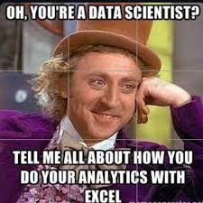

# EXCELL FOR DATA SCIENCE

 

## My Learning Publication
This learning journey, completed through self-directed study, focuses on applying Microsoft Excel for data science by using data cleaning techniques, formulas, pivot tables, and visualization tools to organize, analyze, and interpret structured data for informed decision-making. Through consistent practice, Excel became a practical tool for exploring datasets, identifying patterns, and transforming raw information into meaningful insights.

## Conclusion
Learning Microsoft Excel independently built a strong foundation in data handling and analytical thinking. Mastery of formulas, pivot tables, and data visualization strengthened the ability to structure information, uncover trends, and communicate insights clearly. Beyond technical skills, the experience developed patience, precision, and confidence in working with data — essential qualities that support continued growth in data science.
